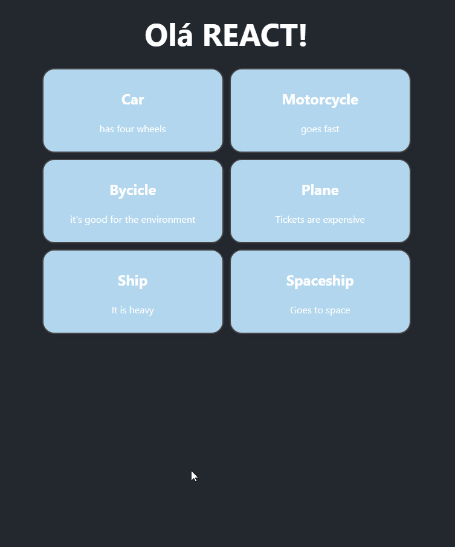

# PROJETO com REACT  | Estudo 💻📚

* Um desafio para aprimorar e consolidar os conhecimentos e habilidades adquiridos no estudo de REACT. 

## Design:


## Instruções para executar o projeto:
1. Abrir o terminal
2. Inserir os seguintes comandos:
   ```
   npm install
   npm run dev
   ```
3. Abrir o link que aparece no console

## Tecnologias utilizadas:

 * HTML
 * CSS
 * JAVASCRIPT
 * REACT

 ### Pra entrar em contato, veja as redes abaixo!
 
<div> 
  <a href="https://instagram.com/maticorrea10" target="_blank"></a>
  <a href = "https://matiasecorrea19@gmail.com"></a>
  <a href="https://www.linkedin.com/in/matías-ezequiel-correa" target="_blank"></a> 
</div>


